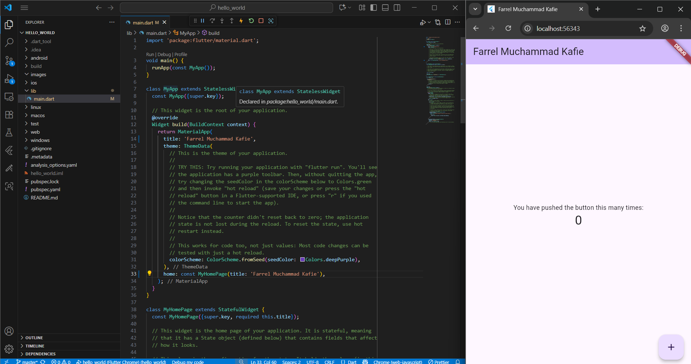
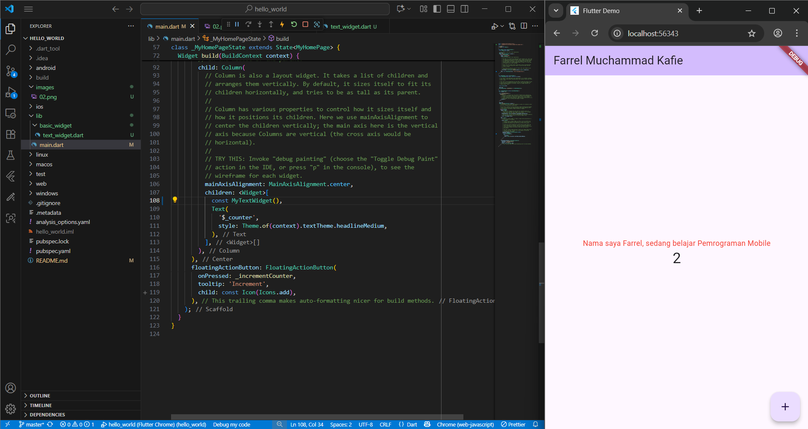
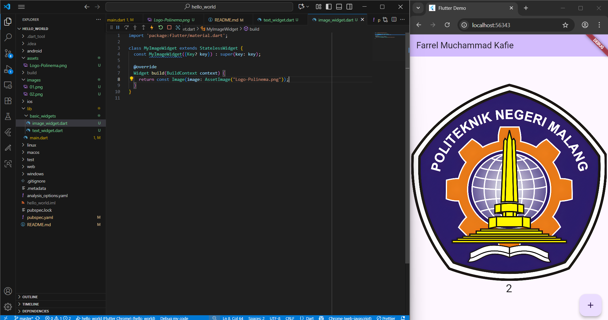
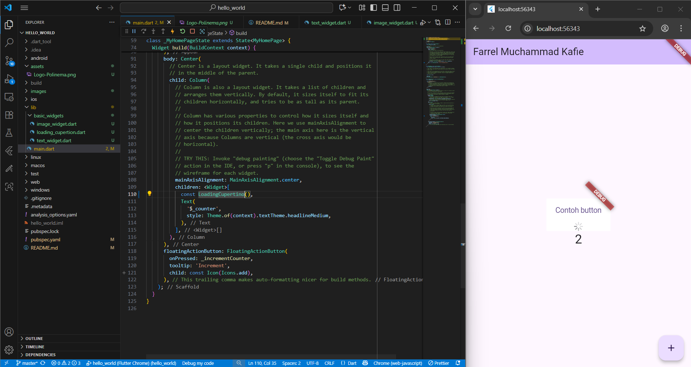
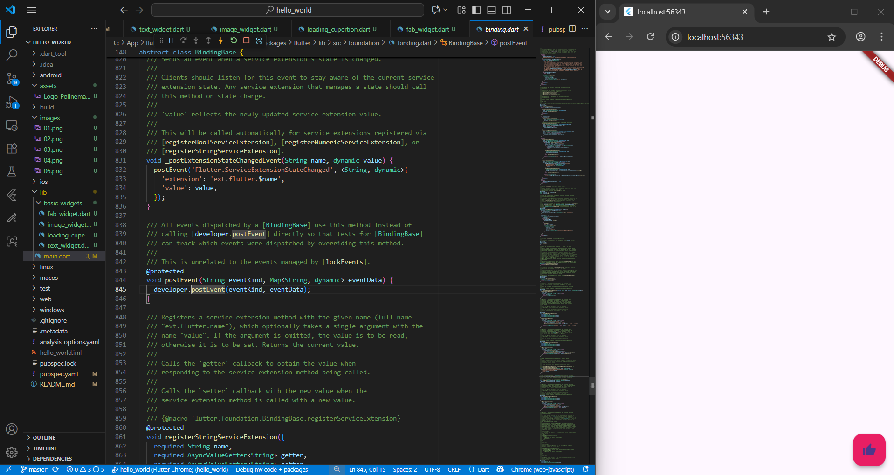
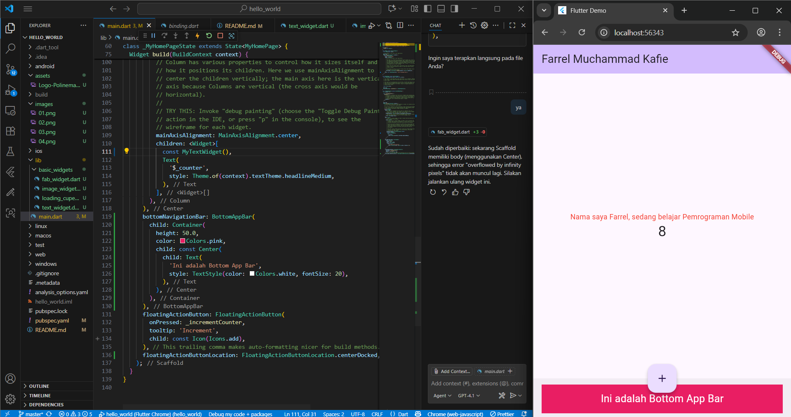
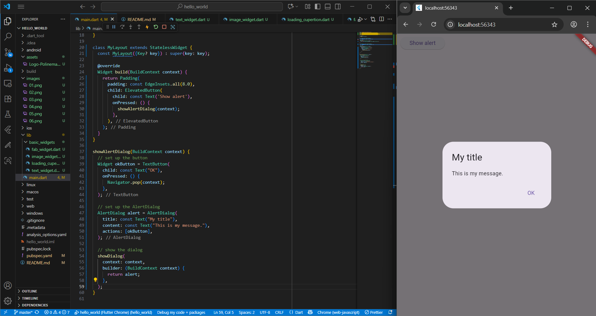
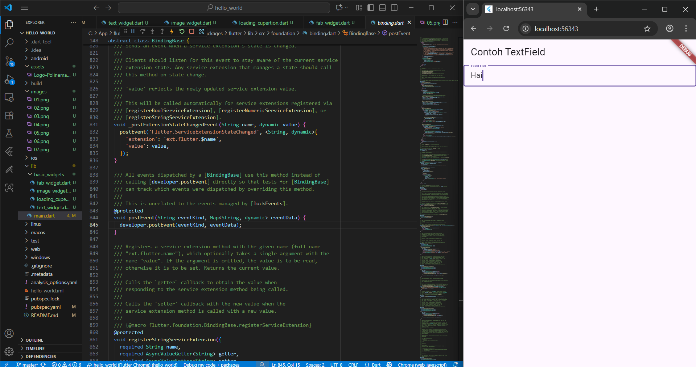
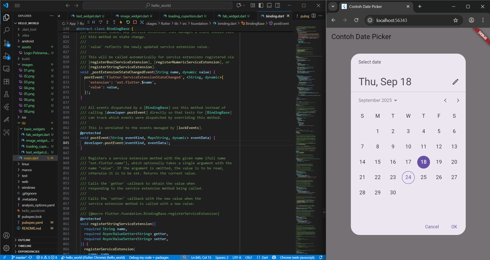

# hello_world

## Nama : Farrel Muchammad Kafie
## NIM  : 2341720176

A new Flutter project.

> Running project flutter baru "hello_world"

> Menerapkan text_widget
Menampilkan teks dengan berbagai gaya menggunakan widget Text.
Bisa diatur ukuran, warna, dan style teks.
Digunakan untuk menampilkan informasi, label, atau judul di aplikasi.

> Menampilkan gambar dari asset lokal menggunakan widget Image
Menampilkan gambar menggunakan widget Image.
Gambar bisa diambil dari asset lokal atau internet.
Dapat digunakan untuk memperlihatkan ilustrasi, foto, atau ikon di aplikasi.

> Implementasi widget Cupertino seperti tombol dan indikator loading.
Menggunakan widget Cupertino untuk tampilan ala iOS.
Menampilkan tombol (CupertinoButton) dan indikator loading (CupertinoActivityIndicator).
Cocok untuk aplikasi yang ingin menampilkan loading dengan gaya iOS.

> FAB
Menampilkan FloatingActionButton pada layout aplikasi.
Membuat widget FloatingActionButton (FAB) di dalam Scaffold.
Ketika FAB ditekan, akan menjalankan aksi (misal: print ke konsol).
Biasanya digunakan untuk aksi utama pada aplikasi.

> Scaffold
Penggunaan Scaffold sebagai struktur dasar aplikasi, termasuk AppBar dan BottomAppBar.
Pada kode ini, Scaffold digunakan untuk:
Menampilkan judul di AppBar.
Menampilkan teks dan angka di tengah layar (body).
Menampilkan bar kosong di bawah (BottomAppBar).
Menampilkan tombol tambah di bawah tengah (FloatingActionButton).

> Dialog
Menampilkan dialog interaktif kepada pengguna.
Kode ini menampilkan dialog (popup) menggunakan widget AlertDialog di Flutter. Berikut penjelasannya:

> Tombol Show Alert

> Pada MyLayout, terdapat tombol ElevatedButton bertuliskan "Show alert".
Ketika tombol ditekan, fungsi showAlertDialog(context) dipanggil.
Fungsi showAlertDialog

> Membuat tombol OK (TextButton) yang menutup dialog saat ditekan (Navigator.pop(context)).
Membuat objek AlertDialog dengan judul, pesan, dan tombol OK.
Menampilkan dialog menggunakan fungsi showDialog, yang menampilkan AlertDialog di atas tampilan utama.

> Implementasi TextField dan widget pemilihan seperti Checkbox atau Radio.
Kode ini adalah contoh penggunaan widget TextField di Flutter:

> AppBar: Menampilkan judul "Contoh TextField" di bagian atas aplikasi.
Body: Berisi satu TextField, yaitu kotak input teks.
TextField:
obscureText: false berarti teks yang diketik akan terlihat (bukan untuk password).
decoration menggunakan InputDecoration:
border: OutlineInputBorder() membuat garis tepi di sekitar kotak input.
labelText: 'Nama' menampilkan label "Nama" di dalam kotak input.

> Menampilkan pemilih tanggal dan waktu menggunakan widget bawaan Flutter.

> State dan Variabel

> selectedDate menyimpan tanggal yang dipilih, default-nya adalah tanggal hari ini.
Fungsi _selectDate

> Fungsi ini menampilkan dialog pemilih tanggal (showDatePicker).
Parameter: tanggal awal, tanggal paling awal, dan tanggal paling akhir yang bisa dipilih.
Jika pengguna memilih tanggal baru, nilai selectedDate di-update dengan setState.
Tampilan (Widget build)

> Menggunakan Scaffold dengan AppBar berisi judul.
Di bagian tengah (body), menampilkan:
Tanggal yang dipilih dalam format lokal.
Tombol "Pilih Tanggal" (ElevatedButton).
Saat tombol ditekan, dialog date picker muncul dan tanggal yang dipilih akan ditampilkan.